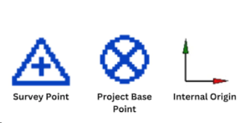
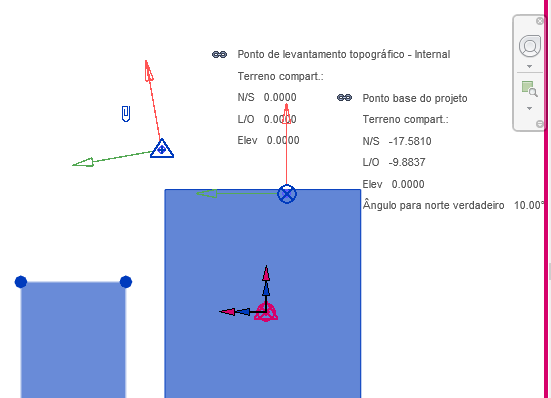
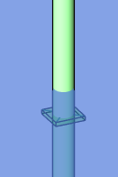
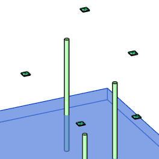

# Plugin Furo Automático para Revit

Este plugin para Revit automatiza a criação de furos em lajes nos pontos de interseção com tubulações, vinculando modelos MEP e estruturais, detectando colisões e inserindo famílias de abertura predefinidas.

## Como usar
1. Salve seu modelo de projeto de furação na mesma pasta dos arquivos RVT (tubos e estrutural)
2. Clique em **"Executar Plugin"** na aba **"Furos Automáticos"** do ribbon do Revit
3. Selecione os modelos:
   - Modelo MEP (tubulações)
   - Modelo Estrutural (lajes)
4. Escolha uma ação:
   - **Executar**: Processar interseções
   - **Cancelar**: Remover vínculos temporários e fechar

## Estrutura do Projeto
```
/FuroAutomaticoRevit
├── 1_App/             # Inicialização do plugin
├── 2_Commands/        # Implementações dos comandos do Revit
├── 3_UI/              # Interface WPF (padrão MVVM)
│   ├── Utils/         # Utilitários de gerenciamento de janelas
│   ├── ViewModels/    # Lógica de negócios
│   ├── Views/         # Componentes visuais
│   └── Resources/     # Estilos e recursos visuais
├── 4_Core/            # Serviços de lógica central
├── 5_Revit/           # Serviços específicos da API do Revit
└── 6_Domain/          # Objetos de transferência de dados (DTOs)
```

---

## Tarefas de Desenvolvimento e Requisitos

### Detectar interseções entre:

Tubulações do arquivo vinculado "Arquivo do Projeto de Tubos"

Lajes do arquivo vinculado "Arquivo do Projeto Estrutural"

### Quando uma interseção for identificada:

Inserir automaticamente uma instância da família "FURO-QUADRADO-LAJE"

A família deve já existir no arquivo de projeto de furos

A profundidade do furo deve exceder a espessura da laje em 5 cm para cima e para baixo

### Aplicar a lógica apenas aos elementos visíveis na vista chamada "Vista Teste":

Ignorar todos os elementos e interseções fora dessa vista específica

---

## Roteiro de Desenvolvimento

### Tarefas Concluídas 
- [x] Integração do plugin ao ribbon
- [x] Interface WPF com arquitetura MVVM
- [x] Carregamento dinâmico de modelos a partir do diretório do projeto
- [x] Vinculação de modelos
- [x] Gerenciamento de visibilidade dos links
- [x] Limpeza de vínculos temporários por sessão
- [x] Manutenção da janela em primeiro plano
- [x] Persistência de seleção nas ComboBoxes

### Tarefas Pendentes 
- [ ] Filtro de elementos por vista ("Vista Teste")
- [x] Serviço de detecção de interseções
- [x] Criação de furos com a família `FURO-QUADRADO-LAJE`
- [ ] Cálculo de dimensões (espessura da laje + 5 cm)
- [ ] Criação do pacote de instalação
- [ ] Criaçao de Log automático de erros
- [ ] Documentação para o usuário
- [ ] Adicionar compatibilidade com outras versões do Revit

### Links Úteis - Revit API
- [`GetWorksetConfiguration` Method](https://www.revitapidocs.com/2023/eefef6f4-0892-4bb5-8840-5e99aebc65c9.htm)
- [`WorksetConfiguration` Class](https://www.revitapidocs.com/2023/eefef6f4-0892-4bb5-8840-5e99aebc65c9.htm)
- [`TaskDialogShowingEventArgs` Class](https://www.revitapidocs.com/2023/96cc0900-708b-5a2c-8d07-b2596ec20700.htm)
- [`SetWorksetConfiguration` Method](https://www.revitapidocs.com/2023/8e0fe0c5-3dd9-806b-6e0d-d42f8d498be2.htm)
- [`View Methods`](https://www.revitapidocs.com/2023/2d37a7c0-7734-3b5b-9f80-c18d38e82ea8.htm)
- [`GetWorksetVisibility` Method](https://www.revitapidocs.com/2023/1c37557b-9bd4-12e2-dffb-c3a25cf9a375.htm)
- [`GetCategoryHidden` Method](https://www.revitapidocs.com/2023/52ce4cea-6f27-9e85-f82a-115e308eebfc.htm)
- [`ReferenceIntersector` Class](https://www.revitapidocs.com/2023/36f82b40-1065-2305-e260-18fc618e756f.htm)
- [`BooleanOperationsUtils` Properties](https://www.revitapidocs.com/2023/89cb7975-cc76-65ba-b996-bcb78d12161a.htm)
- [`Intersect` Method](https://www.revitapidocs.com/2023/570fb842-cac3-83f5-1ab9-621e55186ead.htm)
- [`CropBox` Property (View)](https://www.revitapidocs.com/2023/d6246051-ecfb-7388-0429-6ed65de72638.htm)
- [`CropBox` Property (ViewPlan)](https://www.revitapidocs.com/2023/fc35a86f-e7de-599b-f262-77ce06b3d3ff.htm)
- ['GetSectionBox' Method](https://www.revitapidocs.com/2023/1563dc0f-db89-526d-340b-cdee72e3d254.htm)
- [`GetCropRegionShapeManager` Method](https://www.revitapidocs.com/2023/e2f53728-9b72-227a-f585-9dccf6d79d9f.htm)
- [`GetBoundingBox` Method](https://www.revitapidocs.com/2022/32e76eb1-e305-ead5-0b3b-9eb15891c957.htm?section=seeAlsoToggle)
- [`Intersect` Method (Curve, IntersectionResultArray)](https://www.revitapidocs.com/2023/570fb842-cac3-83f5-1ab9-621e55186ead.htm)
- [`GetProjectBasePoint` Method](https://www.revitapidocs.com/2022/fa70b69b-0339-15d9-7549-fafdb442f756.htm)

### BUGS

#### Os centroides estão sendo criados em locais incorretos 
-> Possivelmente  por causa das diferenças entre as coordenadas do modelo host e dos vinculos.
Ou talvez pelas cotas de nivel das lajes




Testar transformação de coordenadas (host e vinculos) entre:
Survey Point, 
Project Base Point, 
Internal Origin

Verificar logs do commit 8cebfc0: [Log](logs/Debug-Commit-8cebfc0.txt)

#### Os furos estão sendo criados sem seguir os parâmetros 
HEIGHT_PARAM = "FUR.esp-laje" -> Parametro não esta sendo atribuido corretamente na criacao do furo




#### Video demonstrativo - Versão de testes

[Link para o video](https://www.youtube.com/watch?v=-xXK5Q0dqhM)

Nessa versão plugin ainda apresenta bugs. 
O filtro da caixa de corte não funcionou corretamente, resultando em furos fora da area delimitada.